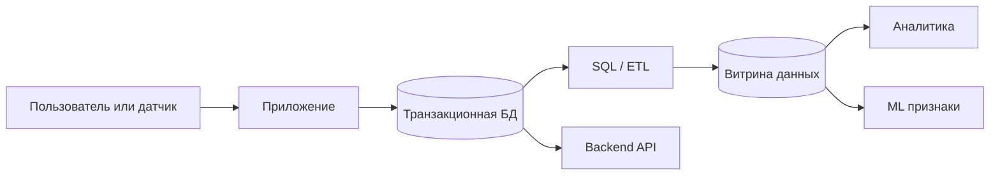
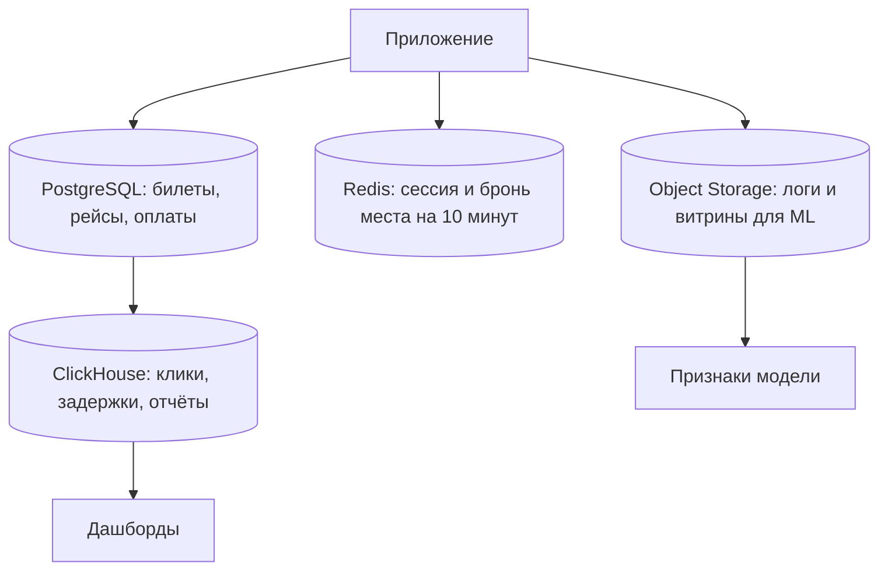
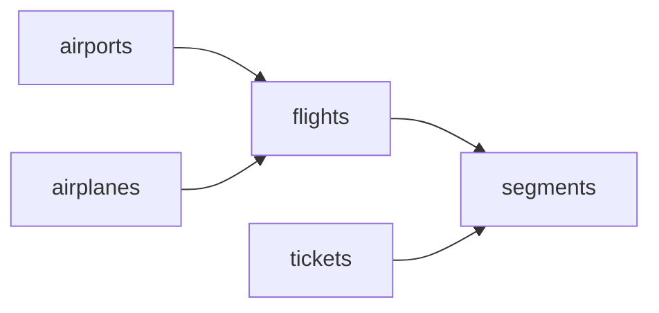

# **Lesson 1. Что такое Базы данных и SQL?**

Сегодня познакомимся с базами данных, PostgreSQL и языком SQL. Посмотрим, откуда берутся данные для аналитики и ML, а затем зададим нашей базе первые вопросы – уже с комментариями, фильтрами, сортировкой и прочими дополнениями!

---

## **Сегодня пройдемся по этому плану:**

1. **Откуда данные** – почему `DataFrame` не появляется сам.
2. **Устройство таблицы и SQL** – отношение, кортеж, атрибут, домен; что за язык.
3. **Разнообразие баз данных** – какими бывают и почему их так много.
4. **Учебная база** `bookings` – схема, grain, первые строки.
5. **Запросы** – комментарии, `SELECT`, псевдонимы, `ORDER BY`, `LIMIT` / `OFFSET`.
6. **Фильтры** – `WHERE`, логика, `LIKE` / `ILIKE`, затем `DISTINCT`.
7. **Выражения и типы** – `CASE`, `NULL`, `CAST`, `JSON`.

---


## **Перед началом**

Подключение к учебной базе, клиенты (`pgAdmin`, `DBeaver`, `psql`) и дым-проверка: [настройка](../Others/setup.md).

---

## **Часть 0. Откуда берётся DataFrame?**

Когда мы начинаем анализ, данные уже выглядят как таблица:

```python
df = pandas.read_csv("dataset.csv")
```

Но таблица не появилась сама. До неё пользователь нажал кнопку, приложение обработало запрос, система проверила ограничения и сохранила событие.

Представим конкретную минуту в аэропорту. Пассажир открыл приложение, выбрал рейс `VKO → LED`, оплатил место `12A`. В этот момент случилось сразу несколько вещей:

1. Приложение спросило систему: «место 12A ещё свободно?»;
2. Система записала бронь, билет и оплату;

3. Другой клиент уже не должен увидеть это место как свободное;
4. Позже аналитик посчитает долю выкупленных мест, а ML-модель – риск no-show.

Если шаг 2 записать «как получится» в файл, шаги 3 и 4 начнут врать.




Одна и та же база интересует разных специалистов.


| Специалист          | Вопрос                                               | Что для него критично                      |
| ------------------- | ---------------------------------------------------- | ------------------------------------------ |
| Аналитик            | Как изменилась доля задержанных рейсов?              | определение задержки, знаменатель, история |
| ML-инженер          | Можно ли предсказать задержку за два часа до вылета? | момент, когда признак уже известен         |
| Backend-разработчик | Как не продать одно место двум пассажирам?           | конкурентность и «всё или ничего»          |


Для ML особенно важно понимать, **когда** появилось значение. Признак, известный только после вылета, нельзя использовать для прогноза до вылета: это target leakage.

> **Target leakage** - ситуация, когда в обучение попал признак, которого не будет в момент прогноза. Модель «подглядывает в будущее» и на тесте внезапно становится слабой.

Пример: колонка `actual_arrival` отлично предсказывает факт прибытия, но к моменту «за два часа до вылета» её ещё нет. SQL здесь не «синтаксис», а способ честно вырезать прошлое.

---


## **Часть I. Что такое база данных?**

> **База данных** - организованная совокупность данных о некоторой предметной области.

Телефонная книга, расписание рейсов, каталог товаров – это уже базы, даже если они живут в Excel.

> **СУБД** - программа, которая хранит данные и метаданные, выполняет запросы, контролирует права, ограничения, конкурентные изменения и восстановление.

В нашем курсе:


| Термин  | Пример                          | Можно трогать руками так        |
| ------- | ------------------------------- | ------------------------------- |
| СУБД    | PostgreSQL                      | сервер в Yandex Cloud           |
| База    | `demo`                          | то, что указано в поле Database |
| Схема   | `bookings`                      | «папка» с учебными таблицами    |
| Таблица | `bookings.flights`              | набор строк про рейсы           |
| Клиент  | `pgAdmin`, `DBeaver` или `psql` | окно, куда мы пишем SQL         |
| Язык    | SQL                             | текст запроса                   |


`pgAdmin` и `DBeaver` – не база. Это графические клиенты. Если закрыть окно, сервер PostgreSQL продолжит работать: как закрыть браузер, сайт из этого не выключается.

### **Из чего состоит таблица**

Таблица в реляционной базе – не «файл Excel с именем». Это **отношение**: набор однотипных записей про одну сущность.

Представим кусок справочника аэропортов:


| airport_code | city             | timezone      |
| ------------ | ---------------- | ------------- |
| VKO          | Moscow           | Europe/Moscow |
| LED          | Saint Petersburg | Europe/Moscow |


Две строки таблицы – две записи про аэропорты. Три имени сверху – три свойства, которые мы храним.

> **Отношение** – таблица в реляционной модели: фиксированный набор свойств и набор записей, у каждой из которых эти свойства заполнены.

> **Атрибут** – одно свойство сущности, колонка. Здесь атрибуты – `airport_code`, `city`, `timezone`.

> **Кортеж** – одна запись отношения, строка. Кортеж `(VKO, Moscow, Europe/Moscow)` – это Внуково, не «Москва вообще».

> **Домен** – из каких значений атрибут *вообще имеет право* состоять. Для `airport_code` – коды аэропортов, не цена и не дата. В PostgreSQL домен на практике задаёт **тип** колонки (`text`, `integer`, `numeric`, `timestamptz`) и ограничения вроде «только существующий код». Ограничения разберём позже; сегодня достаточно: тип – это договор, что в колонку можно класть.

> **Запись** – повседневное имя кортежа. В курсе «строка», «запись» и «кортеж» – про одно и то же. «Колонка», «поле» и «атрибут» – тоже про одно, пока не дойдём до поля внутри JSON.

Как это стыкуется:


| В разговоре         | В модели  | В PostgreSQL      | Пример             |
| ------------------- | --------- | ----------------- | ------------------ |
| строка, запись      | кортеж    | row               | один аэропорт      |
| колонка, поле       | атрибут   | column            | `city`             |
| допустимые значения | домен     | тип + ограничения | `text` / `char(3)` |
| таблица             | отношение | table / view      | `airports`         |


По сути, отношение – множество: одинаковых кортежей быть не должно. PostgreSQL хранит мультимножество: две одинаковые строки могут лежать рядом. Поэтому позже появится способ убрать повторы.

### **Что такое SQL**

Мы уже отправляли серверу строку `SELECT bookings.version();`. Это и есть SQL.

> **SQL** (Structured Query Language) – язык, которым мы описываем, *какой* табличный результат нужен, а иногда – как изменить данные. Это не программа и не база: клиент (`pgAdmin`, `DBeaver`, `psql`) только доставляет текст, исполняет PostgreSQL.

Зачем отдельный язык. 
Вопрос «какие аэропорты в Испании?» должен одинаково читаться человеком и сервером, воспроизводиться завтра и не зависеть от того, в каком файле на диске лежат байты.

SQL **декларативный**: мы говорим, какой набор кортежей хотим, а не как обходить диск. Физический план выбирает СУБД. К порядку слов в запросе вернёмся, когда напишем первый полный `SELECT`.

PostgreSQL, MySQL, SQL Server говорят на SQL, но не слово в слово. Курс – диалект PostgreSQL, справка – [Postgres Pro](https://postgrespro.ru/docs/postgresql/current/tutorial-sql).

В этом курсе почти всё время **читаем**: `SELECT`. Добавлять строки и менять схему – другой разговор; в файлы домашней работы этого класть нельзя.

> Основы таблиц в Postgres Pro: [создание таблицы](https://postgrespro.ru/docs/postgresql/current/ddl-basics). Язык запросов: [The SQL Language](https://postgrespro.ru/docs/postgresql/current/tutorial-sql).


### **Почему не один большой CSV?**

`CSV` очень удобен как выгрузка или переносимый `snapshot`. Скачали файл, открыли в pandas – и поехали. Но работающей системе нужны дополнительные свойства.

Представим `seats.csv` с одной строкой: место `12A`, статус `free`.

**1. Конкурентность.** Аня и Борис одновременно прочитали файл, оба увидели `free`, оба записали продажу. Файл сам спор не разрешит.

**2. Целостность.** В CSV ничего не мешает записать билет на рейс `ZZ999`, которого нет, цену `-15` или второй раз тот же `ticket_no`.

**3. Частичная запись.** Оплата прошла, строка билета не дописалась – процесс упал посередине. СУБД умеет использовать транзакции: либо оба изменения, либо ни одного.

**4. Права.** Студенту курса можно дать только чтение. Сервису бронирования – вставку билета. Администратору – изменение схемы.

**5. Поиск.** Найти рейс `VKO → LED` на конкретную дату в файле на миллиард строк – значит, скорее всего, прочитать его целиком. СУБД может использовать индекс и не тащить всё в память клиента.

**6. Восстановление.** Диск сервера умер в 03:12. Журнал, backup и реплика позволяют поднять состояние, а не «последний CSV, который кто-то скачал в пятницу».

Точная оговорка: CSV не плох. Он хорош как выгрузка, лабораторный snapshot и способ передать датасет однокурснику. Он не является менеджером совместного изменяемого состояния.

> **Транзакция** - набор изменений, который применяется целиком или не применяется совсем. «Списать деньги и выдать билет» должны жить вместе.

---


## **Часть II. Какими бывают базы данных?**

Сначала одно различие, без которого таблица продуктов только путает.

### Реляционные и нереляционные

Про базы говорят сразу в двух смыслах. Их нельзя смешивать.

**Первый разрез – модель: чем является одна запись?**

> **Реляционная БД** – данные лежат в таблицах. У каждой таблицы заранее известен набор колонок. Одна строка – один факт одной сущности. В колонке – значения одного рода: код аэропорта, цена, момент времени.

Таблица – отношение, строка – кортеж, колонка – атрибут, допустимые значения – домен.

Реляционных систем много, не две. Касса: PostgreSQL, MySQL, MariaDB, SQLite, SQL Server, Oracle, YDB. Отчёты по тем же таблицам: ClickHouse, BigQuery, Snowflake, Redshift. Модель одна – таблицы. Движки разные.

> **Нереляционная БД (NoSQL)** – одна запись *не* является строкой фиксированной таблицы. Это документ, пара «ключ → значение» или узел и ребро графа. У соседних записей набор полей может отличаться.

**Второй разрез – хранение: как таблица лежит на диске?** Он имеет смысл, только если модель уже табличная.

> **Построчная БД** – на диске рядом поля *одной строки*. Удобно прочитать, вставить или обновить один билет целиком.

> **Колоночная БД** – на диске рядом все значения *одной колонки*. Удобно посчитать среднюю задержку по миллионам рейсов, не читая ФИО пассажира.

> **Смешанное хранение** – в одной СУБД есть оба уклада. Одни таблицы (или даже вторая копия тех же данных) лежат строками, другие – колонками. Это не третья модель данных, а два способа хранить таблицу внутри одного продукта.

PostgreSQL по умолчанию построчный. ClickHouse – колоночный. SQL Server, Oracle и ряд облачных СУБД умеют смешанно: кассовая таблица строками, витрина или индекс – колонками.

> **SQL** – язык, которым у таблиц часто спрашивают результат. Он не определяет модель: реляционной базу делает таблица, не диалект SQL.

На одном авиационном вопросе:


|                  | Реляционная                                   | Нереляционная                                 |
| ---------------- | --------------------------------------------- | --------------------------------------------- |
| Что такое запись | строка таблицы одной формы                    | документ, ключ или узел графа                 |
| Пример           | строка `tickets`, строка `segments`           | JSON «весь билет сразу» или ключ `ticket:42`  |
| Связи            | ключи между таблицами                         | вложили внутрь документа или собираете в коде |
| Типичный вопрос  | «все рейсы из VKO за 7 дней»                  | «дай этот объект по id»                       |
| Примеры          | PostgreSQL, MySQL, SQLite, Oracle, ClickHouse | MongoDB, Redis, Neo4j, Cassandra              |


Среди реляционных отдельно выбирают хранение:


| Хранение таблицы | Как лежит на диске                   | Под какой вопрос                         | Примеры                         |
| ---------------- | ------------------------------------ | ---------------------------------------- | ------------------------------- |
| Построчное       | поля одной строки рядом              | взять / изменить одну запись             | PostgreSQL, MySQL, SQLite       |
| Колоночное       | значения одной колонки рядом         | просканировать один показатель по всем   | ClickHouse, BigQuery, Snowflake |
| Смешанное        | и строки, и колонки в одном продукте | касса и отчёт не разъезжать по двум СУБД | SQL Server, Oracle In-Memory    |


Кассу обычно отдают построчной таблице: вставить билет и проверить ограничения. Тяжёлый отчёт – колоночной. Если оба вопроса живут в одном продукте – смешанное хранение. Документ, кэш и граф – уже другая модель, не «ещё один способ класть колонки».

### **Реляционные СУБД**

Идея: запись – строка таблицы. Ниже – *построчные* системы: на диске рядом поля одной строки. Колоночные реляционные – отдельным семейством дальше.


| Продукт                  | Зачем существует                                                | Где встречается                                     |
| ------------------------ | --------------------------------------------------------------- | --------------------------------------------------- |
| **PostgreSQL**           | мощный открытый SQL, JSON, расширения, предсказуемые транзакции | наш курс; заказы, билеты, аналитические витрины     |
| **MySQL / MariaDB**      | простой и привычный SQL для веба                                | WordPress, интернет-магазины, много старых сервисов |
| **SQLite**               | база-файл внутри приложения, без отдельного сервера             | мобильные приложения, браузеры, локальные прототипы |
| **Microsoft SQL Server** | корпоративный стек Microsoft                                    | банки, ERP, внутренние системы крупных компаний     |
| **Oracle Database**      | тяжёлый enterprise с долгой историей                            | ядро учёта в очень больших организациях             |
| **YDB**                  | распределённая СУБД Яндекса                                     | внутренние сервисы с большой нагрузкой              |


Почему курс на PostgreSQL: построчная реляционная база, на которой видны ограничения, транзакции и обычный `SELECT`. Колоночный SQL (ClickHouse, BigQuery, Snowflake) – та же табличная модель, другое хранение.

Пример вопроса, который реляционная модель любит:

```text
Какие будущие рейсы из VKO ещё не вылетели, и каким типом самолёта?
```

Для этого нужны связи «рейс → аэропорт» и «рейс → самолёт», а не один гигантский JSON «всё про авиакомпанию».

### **Key-value**

Идея: «дай значение по ключу». Никаких JOIN, зато микросекунды.


| Продукт             | Зачем существует                                       | Пример ключа           |
| ------------------- | ------------------------------------------------------ | ---------------------- |
| **Redis**           | кэш, сессии, очереди, rate limit, временные блокировки | `session:user:481516`  |
| **Memcached**       | ещё более простой кэш в памяти                         | `page:timetable:svo`   |
| **Amazon DynamoDB** | управляемый key-value / документ под облако            | `ticket#0005432000001` |


Авиапример: пользователь начал оплату места 12A. На 10 минут ключ `lock:flight:42:12A` живёт в Redis. Пока ключ есть, второй клиент это место не берёт. Сам билет после оплаты всё равно пишется в PostgreSQL: кэш не должен быть единственной правдой о деньгах.

### **Документные**

Идея: одна запись – JSON с вложенностью. Форма может отличаться у разных документов.


| Продукт       | Зачем существует                             | Что туда кладут                                  |
| ------------- | -------------------------------------------- | ------------------------------------------------ |
| **MongoDB**   | гибкие документы без жёсткой схемы на старте | каталог отелей, профиль пользователя, CMS        |
| **Couchbase** | документы плюс кэш в одном продукте          | сессии и профили в высоконагруженных приложениях |
| **Firestore** | документная база в экосистеме Google         | мобильные клиенты, быстрые прототипы             |


Авиапример: анкета «особые пожелания пассажира» каждый раз разная: детская кроватка, диабет, перевозка лыж. Жёсткая таблица из 200 колонок неудобна; документ `{"ticket": "...", "notes": {...}}` – удобен. Но оплату и номер места всё равно лучше держать реляционно.

### **Графовые**

Идея: главные сущности – узлы и связи. Вопрос звучит как «на каком расстоянии» или «есть ли путь».


| Продукт            | Зачем существует                        | Типичный вопрос                               |
| ------------------ | --------------------------------------- | --------------------------------------------- |
| **Neo4j**          | обходы графа на живых данных            | «не образуют ли эти карты кольцо мошенников?» |
| **Amazon Neptune** | граф как облачный сервис                | knowledge graph, рекомендации                 |
| **JanusGraph**     | граф над большим distributed-хранилищем | очень большие графы связей                    |


Авиапример: пассажир A часто летает с пассажиром B, оба покупают билеты с одной карты, карта связана с ещё пятью «пассажирами» без истории. Реляционно это мучительная пачка JOIN; графу это родной вопрос.

### **Time-series**

Идея: точка `(метрика, время, значение)`. Старые точки можно сжимать и выбрасывать.


| Продукт         | Зачем существует              | Что туда пишут                           |
| --------------- | ----------------------------- | ---------------------------------------- |
| **Prometheus**  | мониторинг сервисов           | CPU, ошибки API, latency                 |
| **InfluxDB**    | метрики и IoT                 | датчики, телеметрия                      |
| **TimescaleDB** | time-series поверх PostgreSQL | если хочется SQL и временные ряды вместе |


Авиапример: каждую секунду самолёт шлёт высоту, скорость, температуру двигателя. Это не таблица билетов. Это поток измерений, который живут месяц в сыром виде и год – в усреднённом.

### **Колоночные реляционные склады**

Идея: модель реляционная, на диске лежат колонки, не строки. Чтобы посчитать среднюю задержку, не читаем ФИО. Это не «нереляционная база», а другой способ хранить таблицу.


| Продукт             | Зачем существует                         | Типичная нагрузка                          |
| ------------------- | ---------------------------------------- | ------------------------------------------ |
| **ClickHouse**      | быстрые аналитические сканы событий      | логи, клики, продуктовая аналитика; Яндекс |
| **Google BigQuery** | склад в облаке, SQL по огромным таблицам | ad-hoc и отчёты без своего кластера        |
| **Snowflake**       | отделённые storage и compute             | корпоративный DWH                          |
| **Amazon Redshift** | колоночный склад в AWS                   | отчёты поверх данных компании              |
| **Apache Druid**    | интерактивные дашборды по событиям       | «сколько кликов за последнюю минуту»       |


Авиапример: «средняя задержка вылета из VKO по неделям за три года». Источник истины о билете – PostgreSQL. Считать такой отчёт каждую минуту по боевой базе заказов – значит мешать продаже билетов. Поэтому события копируют в ClickHouse / DWH.

> **DWH (data warehouse)** - отдельное хранилище, куда складывают историю для отчётов. Туда редко ходят «купить билет», туда ходят «посчитать выручку».


### **Wide-column**

Идея: очень много записи, доступ почти всегда по ключу, схема колонок гибкая.


| Продукт              | Зачем существует                            |
| -------------------- | ------------------------------------------- |
| **Apache Cassandra** | непрерывная запись с нескольких датацентров |
| **ScyllaDB**         | тот же класс задач, другой движок           |
| **HBase**            | широкий ключ-строка в экосистеме Hadoop     |


Пример: лента событий «пользователь открыл экран, кликнул фильтр, ушёл». Писать миллионы таких строк в секунду в базу заказов накладно. Читать их потом «как таблицу билетов» тоже неудобно – для отчёта снова берут колоночную систему.

### **Поиск и объектное хранилище**

Это уже соседние слои, но в реальной архитектуре они стоят рядом с БД.


| Продукт                        | Класс               | Зачем                                                   |
| ------------------------------ | ------------------- | ------------------------------------------------------- |
| **Elasticsearch / OpenSearch** | поисковый движок    | «найди рейсы, в описании которых есть "ночная стоянка"» |
| **S3 / Yandex Object Storage** | объектное хранилище | сырые логи, Parquet, модели, data lake                  |
| **Apache Kafka**               | лог событий, не БД  | доставить событие из приложения в ClickHouse            |


Файлы в S3 – не СУБД: нельзя спросить «все объекты со статусом Arrived», как у таблицы в PostgreSQL. Зато туда дёшево класть гигабайты сырых логов, из которых потом собирают признаки.

### **Как это собирается в одном продукте**

Одна технология не обязана решать всё. Типичная полиглотная схема авиасервиса:




| Вопрос                                               | Куда идти                                |
| ---------------------------------------------------- | ---------------------------------------- |
| Можно ли продать место 12A прямо сейчас?             | PostgreSQL + короткая блокировка в Redis |
| Какая доля рейсов из VKO задержалась в прошлом году? | ClickHouse / DWH                         |
| Какие сырые логи были у приложения вчера в 03:00?    | Object Storage                           |
| Не связан ли этот аккаунт с кольцом мошенников?      | графовая БД или отдельный сервис         |
| Жив ли API бронирования?                             | Prometheus                               |


Выбор системы – архитектурная ответственность, не религия. В этом курсе мы глубоко осваиваем реляционный SQL, потому что он всё равно появляется: как источник истины, как слой витрины, как язык складов.

---


## **Часть III. Знакомимся с** `bookings`

Мы уже в базе `demo`, схема `bookings`. Это учебный снимок авиакассы: аэропорты, рейсы, билеты. Не все таблицы PostgreSQL и не прод «Аэрофлота» – одна предметная область, чтобы на ней учиться спрашивать.

Представим ту же покупку, что в начале пары: пассажир взял место на рейс `VKO → LED`.

1. В справочнике есть аэропорты Внуково и Пулково.
2. Есть конкретный рейс в конкретную дату – не «маршрут вообще».
3. У пассажира появился билет.
4. Внутри билета – один или несколько сегментов: только туда или туда и обратно.

На сегодня хватит пяти имён. Остальные объекты схемы не заучиваем.


| Имя         | Одна строка – это               |
| ----------- | ------------------------------- |
| `airports`  | один аэропорт                   |
| `airplanes` | один тип самолёта               |
| `flights`   | одно выполнение маршрута в дату |
| `tickets`   | один билет пассажира            |
| `segments`  | один билет на одном рейсе       |


Как они связаны. Рейс ссылается на аэропорты и тип самолёта. Сегмент соединяет билет и рейс: «этот пассажир летит этим выполнением».




Ключи пока не разбираем: достаточно стрелки «на что ссылается строка». Ещё встретится `timetable`: тот же рейс, но аэропорты уже подписаны. Пользуемся как готовой таблицей. Как она собрана – на паре про JOIN.

Слева в клиенте те же имена в дереве схемы. SQL-каталог колонок откроем вместе с типами. Сырые имена на русском живут в `airports_data` / `airplanes_data` – в конце пары, когда дойдём до JSON.

### Учебное время

В кассе «сейчас» должно быть одним и тем же у всех и в любой календарный день. Иначе «будущие рейсы» у автора домашки и у вас разъедутся.

```sql
SELECT bookings.now(),
       now();
```

`bookings.now()` – опорный момент снимка. `now()` без схемы – настоящие часы сервера. В домашних заданиях только `bookings.now()`.

Версию датасета мы уже проверяли при подключении: `SELECT bookings.version();`.

### Короткие имена таблиц

На общей базе курса схема `bookings` ищется сама: можно писать `flights`, не `bookings.flights`.

```sql
SHOW search_path;
```

Должно быть что-то вроде `bookings, public`. Если в своей сессии сбилось:

```sql
SET search_path TO bookings, public;
```

В файлы домашки `SET` не копируем: там один `SELECT`. Функцию времени всё равно пишем `bookings.now()`: голое `now()` – системные часы.

---


## **Часть IV. Гранулярность**

> **Гранулярность (grain)** – смысл одного кортежа, то есть одной строки набора данных.

Это один из главных вопросов всего курса:

```text
Одна строка результата означает что?
```

Посмотрим на рейсы:

```sql
SELECT flight_id, route_no, scheduled_departure, status
FROM flights
ORDER BY flight_id
LIMIT 5;
```

Одна строка здесь – не «маршрут вообще», а конкретное выполнение маршрута в конкретную дату. Номер `route_no` повторяется: сегодня VKO → LED в 09:00, завтра снова.

Теперь сегменты:

```sql
SELECT ticket_no, flight_id, fare_conditions, price
FROM segments
ORDER BY ticket_no, flight_id
LIMIT 5;
```

Одна строка – один билет на одном рейсе. Один билет может содержать несколько сегментов: туда и обратно, или пересадка.

Справочник аэропортов – другой grain:

```sql
SELECT airport_code, airport_name, city, country
FROM airports
ORDER BY country, city, airport_code
LIMIT 8;
```

Одна строка – один аэропорт. Город при этом может повторяться: у Москвы несколько кодов.

Почему grain важен в ML и аналитике:

- определяет единицу наблюдения: рейс, билет, пассажир, день;
- помогает сформулировать target: «задержка рейса», а не «задержка вообще»;
- объясняет дубли после JOIN: вы, скорее всего, смешали два уровня;
- определяет правильный train/test split: нельзя случайно положить сегменты одного билета в train и test;
- не позволяет случайно усреднить цены билетов так, будто это цены рейсов.

Перед каждым запросом курса мысленно заканчивайте фразу: «Одна строка результата означает…».

---


## **Часть V. SQL как текст: комментарии и точка с запятой**

SQL мы уже назвали языком про отношения. Теперь – как этот язык выглядит в окне клиента: это текст, который уходит на сервер. Сервер не видит ваши мысли, только statement.

> **Statement** - одно законченное SQL-высказывание. В PostgreSQL его принято завершать точкой с запятой.

```sql
SELECT airport_code, city
FROM airports
LIMIT 3;
```

Без `;` `pgAdmin` часто всё равно выполнит один выделенный запрос, а `psql` будет ждать продолжения – приглашение сменится с `demo=>` на `demo->`. Если запрос «завис», вы, скорее всего, не закрыли statement или строку в кавычках.

### **Комментарии**

Комментарий – текст для человека. Движок его выбрасывает и исполняет оставшееся.

Однострочный комментарий начинается с `--` и идёт до конца строки:

```sql
-- Справочник аэропортов: одна строка – один аэропорт.
SELECT airport_code,  -- IATA-код, например VKO
       city,
       country
FROM airports
ORDER BY city, airport_code
LIMIT 10;
```

Многострочный – между `/*` и `*/`:

```sql
/*
  Быстрый взгляд на типы самолётов.
  Grain: одна строка – один тип борта, не конкретный борт в парке.
*/
SELECT airplane_code, model, range
FROM airplanes
ORDER BY range DESC, airplane_code
LIMIT 5;
```

Комментарий можно вложить в середину запроса, если так читаемее:

```sql
SELECT flight_id,
       status
FROM flights  /* пока смотрим статусы как есть, без фильтра */
ORDER BY flight_id
LIMIT 5;
```

Плохой комментарий повторяет синтаксис: `-- выбираем колонки`. Хороший говорит о смысле: `-- фактическое время ещё не известно, рейс не обязан быть отменён`.

---


## **Часть VI. Первый** `SELECT`

> `SELECT` - описание табличного результата, который мы хотим получить. Не цикл и не «прочитай файл с первой строки».

```sql
SELECT flight_id,
       route_no,
       scheduled_departure,
       departure_airport,
       arrival_airport,
       status
FROM timetable
ORDER BY scheduled_departure, flight_id
LIMIT 10;
```

Разберём запрос:


| Конструкция | Что делает                                    |
| ----------- | --------------------------------------------- |
| `SELECT`    | задаёт колонки и выражения результата         |
| `FROM`      | задаёт источник строк                         |
| `ORDER BY`  | задаёт порядок уже готовых строк              |
| `LIMIT`     | оставляет первые N строк **после** сортировки |
| `;`         | завершает statement                           |


Фильтр строк (`WHERE`) появится отдельной частью. Сейчас учимся брать колонки и смотреть результат. Какие колонки есть у таблицы – смотрите дерево слева или в `psql` команду `\d airports`. SQL-ом список колонок откроем в части про типы: СУБД хранит его сама.

Строки и идентификаторы – разные вещи. Строковое значение пишем в **одинарных** кавычках: `'VKO'`. Имена таблиц и колонок в PostgreSQL можно писать без кавычек: `timetable`, `status`. Двойные кавычки `"Status"` означают имя с учётом регистра; в этом курсе они не нужны.

```sql
-- Одинарные кавычки: это текст, не имя колонки.
SELECT 'VKO' AS airport_code_example,
       departure_airport
FROM timetable
ORDER BY flight_id
LIMIT 5;
```

Без кавычек `VKO` PostgreSQL ищет как имя колонки и падает. Когда дойдём до фильтра, сравнение со строкой тоже будет в одинарных: `departure_airport = 'VKO'`.

> Лексика кавычек в Postgres Pro: [лексическая структура](https://postgrespro.ru/docs/postgresql/current/sql-syntax-lexical). Команда `SELECT`: [SELECT](https://postgrespro.ru/docs/postgresql/current/sql-select).


### **Как запрос пишется и как он исполняется**

`Statement` – несколько частей одного запроса: `SELECT`, `FROM`, `ORDER BY`, `LIMIT`. Каждая со своим словом и своей ролью. Это не четыре запроса и не `\d`.

Мы пишем эти части почти в таком порядке:

```text
SELECT → FROM → ORDER BY → LIMIT
```

PostgreSQL же **логически** обрабатывает их иначе:

```text
FROM → SELECT → ORDER BY → LIMIT
```

Сначала берётся источник, потом считаются выражения колонок, потом сортировка, потом обрезка. Когда появится фильтр, он встанет между `FROM` и `SELECT`. Поэтому псевдоним из `SELECT` в фильтре ещё не существует – разберём в следующей части.

В `ORDER BY` псевдоним уже виден: сортировка позже `SELECT`.

> **Декларативный язык** - мы описываем требуемый результат, а не алгоритм обхода диска. Физический план выбирает PostgreSQL. На следующей паре в этот конвейер встанут `GROUP BY` и `HAVING`. Сегодня их нет.


### **Почему не** `SELECT `* **?**

`SELECT *` удобен для быстрого исследования в `Query Tool`: «покажи, какие вообще есть колонки».

```sql
SELECT *
FROM airplanes
LIMIT 3;
```

В заданиях и в коде, который кто-то будет читать завтра, звёздочка плохо задаёт контракт:

- возвращает лишние колонки;
- может неожиданно измениться вместе со схемой;
- скрывает смысл результата;
- увеличивает передачу данных.

В заданиях курса перечисляем колонки явно.

---


## **Часть VII. Выражения и псевдонимы**

В `SELECT` можно не только перечислять готовые колонки, но и считать новые.

```sql
SELECT flight_id,
       route_no,
       scheduled_arrival - scheduled_departure AS planned_duration
FROM flights
ORDER BY planned_duration DESC, flight_id
LIMIT 8;
```

> **Псевдоним (alias)** - имя колонки **результата**. Пишем через `AS`. Без него PostgreSQL сам подпишет колонку как `?column?` или целиком текстом выражения. Грейдер смотрит на имена: если в условии сказано `arrival_delay`, так и подписываем.

Псевдоним не переименовывает колонку в таблице. Следующий запрос из `flights` снова увидит `scheduled_arrival`, не `planned_duration`.

В `ORDER BY` псевдоним уже виден: сортировка случается **после** `SELECT`.

В `WHERE` его написать нельзя. Логический порядок:

```text
FROM → WHERE → SELECT → ORDER BY → LIMIT
```

Фильтр выполняется, когда списка колонок результата ещё нет. `planned_duration` в этот момент не существует.

```sql
-- Ошибка: псевдонима в WHERE ещё нет.
SELECT flight_id,
       scheduled_arrival - scheduled_departure AS planned_duration
FROM flights
WHERE planned_duration > interval '8 hours';
```

Нужно повторить выражение по колонкам источника – они к моменту фильтра уже есть:

```sql
SELECT flight_id,
       scheduled_arrival - scheduled_departure AS planned_duration
FROM flights
WHERE scheduled_arrival - scheduled_departure > interval '8 hours'
ORDER BY planned_duration DESC, flight_id
LIMIT 8;
```

Когда дойдём до `WHERE`, это то же правило: в фильтре – имена таблицы, в `ORDER BY` – уже можно `AS`.

---


## **Часть VIII. Сортировка:** `ORDER BY`**,** `LIMIT` **и** `OFFSET`


### Что сортируется

`ORDER BY` задаёт порядок **строк результата**, не таблицу на диске. Строка едет целиком. В `ORDER BY` видны и колонки таблицы, и псевдонимы из `SELECT`.

Без `ORDER BY` порядка нет: совпало два запуска подряд – контракта всё равно нет.

### Как сортировать

Одно поле, по возрастанию. `ASC` можно не писать – это направление по умолчанию:

```sql
SELECT airplane_code, model, range
FROM airplanes
ORDER BY range;
```

По убыванию – `DESC`:

```sql
SELECT airplane_code, model, range
FROM airplanes
ORDER BY range DESC;
```


### Несколько колонок

Ключи слева направо. Следующий работает, только если по предыдущему строки равны:

```sql
SELECT airport_code, city, country
FROM airports
ORDER BY country, city, airport_code
LIMIT 15;
```

Направления можно смешивать: `ORDER BY range DESC, airplane_code`. Если после всех ключей строки ещё равны, порядок между ними снова не обещан – поэтому последним часто ставят уникальное поле.

При `ASC` в PostgreSQL `NULL` обычно внизу, при `DESC` – вверху.

### Обрезка: `LIMIT` и `OFFSET`

`LIMIT` режет уже упорядоченный результат. «Десять самых дальних» без `ORDER BY range DESC` бессмысленно.

```sql
SELECT airplane_code, model, range
FROM airplanes
ORDER BY range DESC, airplane_code
LIMIT 5;
```

`OFFSET` пропускает строки **после** сортировки. Страница результата: `LIMIT 10 OFFSET 10`. Без `ORDER BY` так же бессмысленен. `OFFSET 0` можно не писать.

> Postgres Pro: [сортировка](https://postgrespro.ru/docs/postgresql/current/queries-order), [LIMIT и OFFSET](https://postgrespro.ru/docs/postgresql/current/queries-limit).

---


## **Часть IX. Фильтрация:** `WHERE` **и операторы сравнения**

`WHERE` оставляет строки, для которых условие оказалось `TRUE`. Строковое значение в фильтре – в одинарных кавычках: `'VKO'`, не `"VKO"` и не голое `VKO`.

```sql
SELECT airport_code, city, country
FROM airports
WHERE country = 'Spain'
ORDER BY city, airport_code
LIMIT 10;
```

Несколько условий сразу пока читайте как «и». Сами `AND` / `OR` и сравнение времени – следующими частями.

### **Операторы сравнения**


| Оператор          | Смысл           | Пример                  |
| ----------------- | --------------- | ----------------------- |
| `=`               | равно           | `country = 'Germany'`   |
| `<>` или `!=`     | не равно        | `status <> 'Cancelled'` |
| `<` `>` `<=` `>=` | меньше / больше | `range >= 4000`         |


Оба варианта «не равно» в PostgreSQL работают; в курсе чаще пишем `<>` – это запись из стандарта SQL.

```sql
SELECT airport_code, airport_name, country
FROM airports
WHERE country <> 'Russia'
ORDER BY country, airport_code
LIMIT 10;
```

```sql
SELECT airplane_code, model, range
FROM airplanes
WHERE range < 3000
ORDER BY range, airplane_code;
```

Числа пишем без кавычек: `3000`. Строки – в кавычках: `'Germany'`. `'3000'` и `3000` для PostgreSQL разные вещи.

В фильтре – имя колонки таблицы, не псевдоним из `SELECT`. Почему так, разобрали в части про `AS`: `WHERE` исполняется раньше, чем появляется список колонок результата.

> Postgres Pro: [табличные выражения и WHERE](https://postgrespro.ru/docs/postgresql/current/queries-table-expressions), [сравнения](https://postgrespro.ru/docs/postgresql/current/functions-comparison).

---


## **Часть X.** `AND`**,** `OR`**,** `NOT`**,** `IN`

`AND` требует, чтобы оба условия были истинны. `OR` – чтобы истинным оказалось хотя бы одно. `NOT` переворачивает условие.

```sql
SELECT airport_code, airport_name, city, country
FROM airports
WHERE country = 'Germany'
  AND city = 'Berlin'
ORDER BY airport_code;
```

Несколько допустимых значений удобно записывать через `IN`:

```sql
SELECT airport_code, airport_name, city
FROM airports
WHERE city IN ('Berlin', 'Munich', 'Hamburg')
ORDER BY city, airport_code;
```

Это то же самое, что цепочка `OR` по равенству, только читаемее.

`NOT IN` исключает список:

```sql
SELECT airplane_code, model, range
FROM airplanes
WHERE airplane_code NOT IN ('CN1', 'CR2')
ORDER BY range DESC, airplane_code
LIMIT 10;
```

Осторожно: `NOT IN` с `NULL` внутри списка ведёт себя сюрпризно. Сегодня списки у нас из конкретных значений, без пропусков.

`AND` связывает сильнее, чем `OR`. Если в одном фильтре есть и то и другое, поставьте скобки вокруг смысла:

```sql
WHERE (departure_airport = 'LED' OR arrival_airport = 'LED')
  AND status = 'Scheduled'
```

Без скобок `AND` приклеится только ко второму аэропорту – это уже другой вопрос.

---


## **Часть XI.** `BETWEEN` **и сравнение времени**


### Числа: `BETWEEN`

`BETWEEN` включает **обе** границы:

```sql
SELECT airplane_code, model, range, speed
FROM airplanes
WHERE speed BETWEEN 500 AND 700
ORDER BY speed, airplane_code;
```

Это то же самое, что `speed >= 500 AND speed <= 700`. Для дальности и скорости так писать удобно.

### Время: полуинтервал `[начало, конец)`

Для соседних периодов закрытый отрезок опасен. Если январь закончить в `'2025-02-01'`, а февраль начать с того же момента, полночь попадёт в оба периода.

Поэтому время сравниваем так: начало включено, конец исключён.

```sql
event_time >= period_start
AND event_time < period_end
```

Подзадача: ближайшие будущие `Scheduled` из LED.

```sql
SELECT flight_id,
       route_no,
       scheduled_departure,
       arrival_airport
FROM timetable
WHERE departure_airport = 'LED'
  AND status = 'Scheduled'
  AND scheduled_departure >= bookings.now()
  AND scheduled_departure <  bookings.now() + interval '5 days'
ORDER BY scheduled_departure, flight_id
LIMIT 12;
```

Каждый кусок фильтра отвечает за кусок вопроса: аэропорт, статус, «не раньше сейчас», «строго раньше чем через пять дней».

> `interval` - типизированная длительность: `interval '7 days'`, `interval '2 hours'`.

```sql
SELECT bookings.now()                     AS demo_now,
       bookings.now() + interval '7 days' AS in_a_week;
```

`BETWEEN` для таких окон не используем: он включил бы правую границу.

---


## **Часть XII. Поиск по шаблону:** `LIKE` **и** `ILIKE`

Точное равенство не умеет сказать «начинается с», «заканчивается на» или «содержит». Для этого шаблон.

> `LIKE` - сравнение строки с шаблоном. `%` – сколько угодно символов (в том числе ноль), `_` – ровно один символ.


| Вопрос        | Шаблон     | Читается как                  |
| ------------- | ---------- | ----------------------------- |
| начинается с  | `'New %'`  | New, пробел, потом что угодно |
| заканчивается | `'%burg'`  | что угодно, потом burg        |
| содержит      | `'%port%'` | port где-то внутри            |
| один любой    | `'S_O'`    | S, один символ, O             |


```sql
SELECT airport_code, airport_name, timezone
FROM airports
WHERE timezone LIKE 'Asia/%'
ORDER BY timezone, airport_code
LIMIT 12;
```

`Asia/%` – начинается с `Asia/`. `Europe/Moscow` сюда не войдёт.

`LIKE` чтит регистр: `'Berlin'` и `'berlin'` для него разные. Для имён почти всегда нужен `ILIKE` – тот же шаблон, без учёта регистра.

```sql
SELECT ticket_no, passenger_id, passenger_name
FROM tickets
WHERE passenger_name ILIKE '%ANNA%'
ORDER BY passenger_name, ticket_no
LIMIT 10;
```

В домашке, где сказано «без учёта регистра», берите `ILIKE`. Функция `lower` не нужна.

Две частые ошибки: `LIKE 'New'` без `%` – это точное равенство; `_` – не «что угодно», а ровно один символ.

> Postgres Pro: [совпадение по шаблону](https://postgrespro.ru/docs/postgresql/current/functions-matching).

---


## **Часть XIII. Уникальные значения:** `DISTINCT`

Фильтр отбрасывает строки. `DISTINCT` убирает **повторы в результате** – это не «ещё один WHERE». Таблица PostgreSQL не множество: одинаковые значения колонки могут лежать сколько угодно раз, пока не попросите иначе.

```sql
SELECT country
FROM airports
ORDER BY country
LIMIT 20;
```

Страны повторяются: grain таблицы – аэропорт.

```sql
SELECT DISTINCT country
FROM airports
ORDER BY country;
```

Теперь одна строка результата – одна страна. Grain изменился.

`DISTINCT` смотрит на всю комбинацию выбранных колонок, не на каждую по отдельности:

```sql
SELECT DISTINCT city, country
FROM airports
ORDER BY country, city;
```

Москва останется одной строкой, даже если аэропортов несколько. Коды аэропортов сюда не попадут: мы их не выбирали.

Конвейер на сейчас:

```text
FROM → WHERE → SELECT → DISTINCT → ORDER BY → LIMIT → OFFSET
```

Сначала фильтр, потом колонки, потом схлопывание повторов, потом сортировка.

> Postgres Pro: [SELECT DISTINCT](https://postgrespro.ru/docs/postgresql/current/queries-select-lists#QUERIES-DISTINCT).

---


## **Часть XIV. Булевы значения**

В `tickets` есть колонка `outbound`: это уже не строка `'true'`, а тип `boolean`.

Сравнивать булево как строку не нужно. Проверяем предикатом:

```sql
SELECT ticket_no, passenger_name, outbound
FROM tickets
WHERE outbound IS FALSE
ORDER BY passenger_name, ticket_no
LIMIT 8;
```


| Проверка               | Кого оставит                                                               |
| ---------------------- | -------------------------------------------------------------------------- |
| `outbound IS TRUE`     | только `TRUE`                                                              |
| `outbound IS FALSE`    | только `FALSE`                                                             |
| `outbound IS NOT TRUE` | `FALSE` и `NULL`                                                           |
| `WHERE outbound`       | в PostgreSQL сработает как «истина», но явное `IS TRUE` читается спокойнее |


Почему не `= TRUE`? Для значения `TRUE` сработает и оно. `IS TRUE` лучше тем, что это проверка предиката: `NULL IS TRUE` даёт `FALSE`, а не `UNKNOWN`, и намерение видно в тексте запроса.

Ещё один булев пример – из выражения, которое мы уже считали:

```sql
SELECT airplane_code, model, range
FROM airplanes
WHERE (range >= 8000) IS TRUE
ORDER BY range DESC, airplane_code;
```

Скобки здесь для глаз: «сначала сравнение, потом проверка». Обычно пишут просто `WHERE range >= 8000`.

---


## **Часть XV. Ветвление в результате:** `CASE`

Фильтр отбрасывает строки. Иногда строку нужно оставить, но **пометить**.

> `CASE` - выражение, которое выбирает значение по условиям. Срабатывает **первое истинное** `WHEN`.

```sql
SELECT airplane_code,
       model,
       range,
       CASE
           WHEN range >= 8000 THEN 'long_haul'
           WHEN range >= 3000 THEN 'medium_haul'
           ELSE 'short_haul'
       END AS haul_class
FROM airplanes
ORDER BY range DESC, airplane_code;
```

Порядок `WHEN` важен: если сначала написать `range >= 3000`, дальние самолёты туда и попадут. `ELSE` ловит всё остальное.

Чаще всего `CASE` живёт в `SELECT`: новая колонка-категория. В `WHERE` он тоже допустим, но обычно проще обычное условие.

---


## **Часть XVI. Пропуски и** `NULL`

> `NULL` – значение неизвестно или неприменимо. Это не `0`, не `''` и не «ложь».

Сравнить с неизвестным нельзя: не с чем. Результат сравнения – не TRUE и не FALSE, а **UNKNOWN**.

`WHERE` оставляет только `TRUE`. `UNKNOWN` выкидывается. Поэтому так всегда пусто:

```sql
WHERE actual_departure = NULL
```

Нужен прямой вопрос про отсутствие:

```sql
SELECT flight_id, actual_departure
FROM flights
WHERE actual_departure IS NULL
LIMIT 8;
```

Есть факт – `IS NOT NULL`.


| Написали      | Смысл                           |
| ------------- | ------------------------------- |
| `= NULL`      | не работает, всегда UNKNOWN     |
| `IS NULL`     | значения нет                    |
| `IS NOT NULL` | значение есть                   |
| `NULL = NULL` | UNKNOWN: два пропуска ≠ «равны» |
| `5 = NULL`    | UNKNOWN                         |


Ловушка: `status <> 'Cancelled'` не берёт строки, где `status` сам `NULL`. `NULL <> 'Cancelled'` тоже UNKNOWN.

Для ML пропуск – не «почти ноль». «Задержка 0 минут» и «мы не знаем» – разные признаки. Заполнять все `NULL` нулём нельзя: смешаете факт и дыру, часто с leakage.

> Postgres Pro: [сравнения и NULL](https://postgrespro.ru/docs/postgresql/current/functions-comparison).


## **Часть XVII. Типы данных и приведение**

Каждая колонка в PostgreSQL имеет тип. Это не подпись для человека, а правило: что можно сложить, с чем сравнить, как округлить.

Посмотрим на типы глазами каталога:

```sql
SELECT column_name, data_type, udt_name
FROM information_schema.columns
WHERE table_schema = 'bookings'
  AND table_name = 'flights'
ORDER BY ordinal_position;
```

В нашем датасете и в PostgreSQL вообще часто встречаются такие числа и текст:


| Тип                | Синоним   | Что это                    | Где у нас                     | Чего ждать                                  |
| ------------------ | --------- | -------------------------- | ----------------------------- | ------------------------------------------- |
| `smallint`         | `int2`    | целое, 2 байта             | редко                         | диапазон примерно ±32 тысячи                |
| `integer`          | `int4`    | целое, 4 байта             | `range`, `speed`, `flight_id` | обычные счётчики и километры                |
| `bigint`           | `int8`    | целое, 8 байт              | большие id                    | когда `integer` не влезает                  |
| `numeric(10,2)`    | `decimal` | точная десятичная дробь    | `price`, `total_amount`       | деньги: 10.50 это ровно 10.50               |
| `real`             | `float4`  | двоичная дробь, ~6 знаков  | в `bookings` почти нет        | быстрее, но 0.1 + 0.2 может дать 0.30000001 |
| `double precision` | `float8`  | двоичная дробь, ~15 знаков | в `bookings` почти нет        | научные расчёты; **не** цены                |
| `text` / `varchar` |           | строка любой длины         | имена, статусы                | `LIKE`, склейка                             |
| `character(3)`     | `char(3)` | строка ровно 3 символа     | `airport_code`                | сравниваем как текст: `'VKO'`               |
| `boolean`          |           | истина / ложь              | `outbound`                    | `IS TRUE` / `IS FALSE`                      |
| `timestamptz`      |           | момент с часовым поясом    | вылеты, `book_date`           | вычитание даёт `interval`                   |
| `interval`         |           | длительность               | разность двух моментов        | `interval '7 days'`                         |
| `jsonb`            |           | JSON-документ              | `airports_data.airport_name`  | `->>` достаёт текст                         |


`real` и `double precision` – это не «дробь как в школе», а приближение. Для денег в курсе и в проде берите `numeric`. Посмотрите сами:

```sql
SELECT 0.1::real + 0.2::real                         AS real_sum,
       0.1::double precision + 0.2::double precision AS double_sum,
       0.1::numeric + 0.2::numeric                   AS numeric_sum;
```

У `numeric` сумма будет `0.3`. У `real` / `double` часто нет. `float` в PostgreSQL – это синоним `double precision`, не отдельный тип.

Целое на целое отрезает хвост: `7 / 2` даёт `3`. Чтобы получить `3.5`, пишите `7 / 2.0` или `7::numeric / 2`.

> Числовые типы в Postgres Pro: [numeric types](https://postgrespro.ru/docs/postgresql/current/datatype-numeric).

`char(3)` у кода аэропорта – это тоже текст, просто фиксированной длины. Сравниваем его как строку: `departure_airport = 'VKO'`.

### Зачем приводить тип

Иногда тип «почти тот», но не тот. Целое деление отрезает дробь. Дата лежит внутри timestamp, а нам нужен только день. Число нужно вклеить в подпись.

> **Приведение типа** - явное «считай это значение как другой тип». В PostgreSQL два равноправных написания: `значение::тип` и `CAST(значение AS тип)`.

```sql
SELECT 7 / 2              AS integer_division,   -- 3, хвост отрезали
       7 / 2.0            AS with_float,         -- 3.5
       7::numeric / 2     AS with_cast;          -- 3.5
```

Короткий `::` в курсе используем чаще: его видно в одном взгляде. `CAST` удобен, если читаете стандарт SQL или другой диалект.

```sql
SELECT CAST(7 AS numeric) / 2 AS with_cast_standard;
```


### Дата из момента

В `scheduled_departure` лежит момент целиком. Если нужен только календарный день:

```sql
SELECT flight_id,
       scheduled_departure,
       scheduled_departure::date AS departure_date
FROM flights
ORDER BY flight_id
LIMIT 8;
```

`::date` отбрасывает время. Все рейсы одного дня становятся сравнимы по дате. На следующей паре из этого получится группировка «по дням».

Число в подпись не вклеить напрямую: сначала `range::text`, потом `||`.

```sql
SELECT airplane_code,
       'дальность ' || range::text || ' км' AS range_label
FROM airplanes
ORDER BY range DESC, airplane_code
LIMIT 5;
```

Обратно строка с цифрами становится числом: `'8000'::integer`. Мусор вроде `'восемь'::integer` даст ошибку – приведение строгое.

### Деньги и округление

`price` имеет тип `numeric(10, 2)`: это не «примерно float», а точные две цифры после запятой.

```sql
SELECT ticket_no,
       flight_id,
       price,
       price::integer AS price_truncated,  -- отрезали копейки, не округлили по правилам школы
       round(price, 0) AS price_rounded    -- округлили
FROM segments
ORDER BY price DESC, ticket_no, flight_id
LIMIT 8;
```

`::integer` для `numeric` отбрасывает дробную часть. `round` округляет. Для витрины почти всегда нужен `round`, не молчаливое отрезание.

---


## **Часть XVIII. JSON: два языка в одной ячейке**

Аэропорт в `bookings` – обычная табличная сущность: код, координаты, таймзона. Имя при этом нужно на двух языках. Его кладут не во вторую таблицу «переводов», а в одну ячейку маленьким документом.

Две поверхности одной сущности:


| Что открыть     | Что внутри                                  | Когда брать                  |
| --------------- | ------------------------------------------- | ---------------------------- |
| `airports`      | уже готовый английский текст                | почти все задачи курса и HW1 |
| `airports_data` | сырой документ `{"en": "...", "ru": "..."}` | нужен русский или оба языка  |


То же у самолётов: `airplanes` – английская модель, `airplanes_data` – JSON в колонке `model`.

Посмотрим сырой документ:

```sql
SELECT airport_code, airport_name
FROM airports_data
WHERE airport_code = 'VKO';
```

В `airport_name` будет примерно `{"en": "Sheremetyevo", "ru": "Шереметьево"}`. Это тип `jsonb`: JSON *внутри ячейки*, а не отдельная документная база вроде MongoDB.

> `jsonb` - JSON, который PostgreSQL хранит разобранным. Из него можно достать ключ.

Два оператора, и путать их нельзя:


| Написали                | Тип           | Что на экране               | Зачем                                               |
| ----------------------- | ------------- | --------------------------- | --------------------------------------------------- |
| `airport_name ->> 'ru'` | обычный текст | `Шереметьево`               | подпись, `WHERE`, `ILIKE`                           |
| `airport_name -> 'ru'`  | снова JSON    | `"Шереметьево"` со скобками | копать документ дальше; в этом курсе почти не нужен |


Подзадача: показать Шереметьево и Пулково на обоих языках.

```sql
SELECT airport_code,
       airport_name ->> 'en' AS name_en,
       airport_name ->> 'ru' AS name_ru
FROM airports_data
WHERE airport_code IN ('VKO', 'LED')
ORDER BY airport_code;
```

Достали текст – дальше как с любой строкой:

```sql
SELECT airport_code,
       airport_name ->> 'ru' AS name_ru
FROM airports_data
WHERE airport_name ->> 'ru' ILIKE '%шереметьево%';
```

Если написать `WHERE airport_name -> 'ru' ILIKE ...`, PostgreSQL обидится: слева JSON, справа шаблон для текста. Нужен `->>`.

Представление `airports` уже сделало `->>'en'` за нас. В HW1 пишите в `airports` и `airplanes`, не в `*_data`. Русский на учебной базе достаём руками из `airports_data`: язык view на общей базе не переключается.

> Стабильные сущности (рейс, билет, оплата) живут колонками. Перевод и «у объекта свой набор полей» – удобный случай для `jsonb` в отдельной колонке.

---


## **Шпаргалка операторов этой пары**

Собрали в одно место то, чем будем пользоваться до агрегатов:


| Задача                        | Инструмент                         | Короткий пример                         |
| ----------------------------- | ---------------------------------- | --------------------------------------- |
| Взять колонки                 | `SELECT ... FROM`                  | `SELECT city FROM airports`             |
| Подписать колонку             | `AS`                               | `range AS airplane_range`               |
| Посчитать выражение           | арифметика, вычитание времени      | `actual_arrival - scheduled_arrival`    |
| Склеить со строкой            | `::text` и конкатенация            | `'дальность '                           |
| Порядок                       | `ORDER BY`                         | `ORDER BY range DESC, airplane_code`    |
| Несколько ключей              | слева направо                      | страна, потом город, потом код          |
| Обрезать                      | `LIMIT`                            | `LIMIT 10`                              |
| Пропустить строки             | `OFFSET`                           | `LIMIT 10 OFFSET 10`                    |
| Отфильтровать                 | `WHERE`                            | `WHERE country = 'Spain'`               |
| Несколько условий сразу       | `AND`                              | `country = 'Spain' AND city = 'Madrid'` |
| Хотя бы одно                  | `OR` + скобки                      | `(a = 'LED' OR b = 'LED')`              |
| Список значений               | `IN`                               | `city IN ('Madrid', 'Barcelona')`       |
| Закрытый диапазон числа       | `BETWEEN`                          | `speed BETWEEN 500 AND 700`             |
| Период времени без дыр        | полуинтервал `[start, end)`        | `ts >= x AND ts < y`                    |
| Шаблон с регистром            | `LIKE`                             | `timezone LIKE 'Asia/%'`                |
| Начинается / содержит / конец | `'New %'` / `'%port%'` / `'%burg'` | смотрите позицию `%`                    |
| Шаблон без регистра           | `ILIKE`                            | `name ILIKE '%anna%'`                   |
| Один любой символ             | `_`                                | `airport_code LIKE 'S_O'`               |
| Убрать повторы                | `DISTINCT`                         | `SELECT DISTINCT country`               |
| Булево поле                   | `IS TRUE` / `IS FALSE`             | `outbound IS FALSE`                     |
| Категория в результате        | `CASE`                             | `WHEN range >= 8000 THEN 'long_haul'`   |
| Пропуск                       | `IS NULL` / `IS NOT NULL`          | `actual_departure IS NULL`              |
| Привести тип                  | `::` или `CAST`                    | `scheduled_departure::date`             |
| Достать JSON-текст            | `->>`                              | `airport_name ->> 'ru'`                 |
| Достать JSON-кусок            | `->`                               | `airport_name -> 'ru'`                  |
| Пояснение человеку            | `--` и `/* ... */`                 | `-- grain: один аэропорт`               |


Логический порядок, который стоит проговорить вслух перед запуском:

```text
FROM → WHERE → SELECT → DISTINCT → ORDER BY → LIMIT → OFFSET
```

---


## **Итог**

Сегодня мы:

- увидели путь от события до DataFrame;
- разобрали устройство таблицы: отношение, кортеж, атрибут, домен – и что SQL это язык про такой результат, а не программа;
- поняли, зачем приложению СУБД и почему CSV остаётся выгрузкой, а не кассой;
- разобрали модели данных и живые продукты: PostgreSQL, Redis, MongoDB, Neo4j, ClickHouse и соседей;
- познакомились с предметной областью `bookings` и научились спрашивать grain;
- написали `SELECT` с комментариями, псевдонимами, сортировкой и `LIMIT`;
- затем фильтровали: сравнение, `AND` / `OR` / `IN`, `BETWEEN`, `LIKE` / `ILIKE`;
- убрали повторы через `DISTINCT`;
- собрали `CASE`, булевы проверки, `NULL`;
- научились приводить типы и доставать текст из JSON.

На следующей паре перейдём от отдельных строк к показателям: агрегатам, группировкам и `HAVING`. Там же логический конвейер пополнится новыми ступенями – уже поверх сегодняшнего `FROM → WHERE → SELECT`.

До встречи на следующей страничке!

## **Полезное**

Документация [Postgres Pro](https://postgrespro.ru/docs/postgresql/current/) – основной справочник курса (русский текст, тот же PostgreSQL).

- [Что такое SQL](https://postgrespro.ru/docs/postgresql/current/tutorial-sql)
- [Таблица, колонки, строки](https://postgrespro.ru/docs/postgresql/current/ddl-basics)
- [Лексика кавычек](https://postgrespro.ru/docs/postgresql/current/sql-syntax-lexical)
- [SELECT](https://postgrespro.ru/docs/postgresql/current/sql-select)
- [WHERE и FROM](https://postgrespro.ru/docs/postgresql/current/queries-table-expressions)
- [ORDER BY](https://postgrespro.ru/docs/postgresql/current/queries-order)
- [LIMIT и OFFSET](https://postgrespro.ru/docs/postgresql/current/queries-limit)
- [DISTINCT](https://postgrespro.ru/docs/postgresql/current/queries-select-lists#QUERIES-DISTINCT)
- [Сравнения, IN, BETWEEN, NULL](https://postgrespro.ru/docs/postgresql/current/functions-comparison)
- [LIKE и ILIKE](https://postgrespro.ru/docs/postgresql/current/functions-matching)
- [CASE](https://postgrespro.ru/docs/postgresql/current/functions-conditional)
- [Типы данных](https://postgrespro.ru/docs/postgresql/current/datatype)
- [Числа: integer, numeric, real, double](https://postgrespro.ru/docs/postgresql/current/datatype-numeric)
- [Приведение типов](https://postgrespro.ru/docs/postgresql/current/sql-expressions#SQL-SYNTAX-TYPE-CASTS)
- [Дата, время, interval](https://postgrespro.ru/docs/postgresql/current/functions-datetime)
- [JSON и jsonb](https://postgrespro.ru/docs/postgresql/current/functions-json)
- [information_schema](https://postgrespro.ru/docs/postgresql/current/information-schema)
- [Клиент](https://postgrespro.ru/docs/postgresql/current/app-psql) `psql`
- [Демобаза «Авиаперевозки»](https://postgrespro.ru/docs/postgrespro/current/demodb-bookings)
- [pgAdmin](https://www.pgadmin.org/docs/)
- [DBeaver Community](https://dbeaver.io/download/), [подключение](https://github.com/dbeaver/dbeaver/wiki/Create-Connection)

