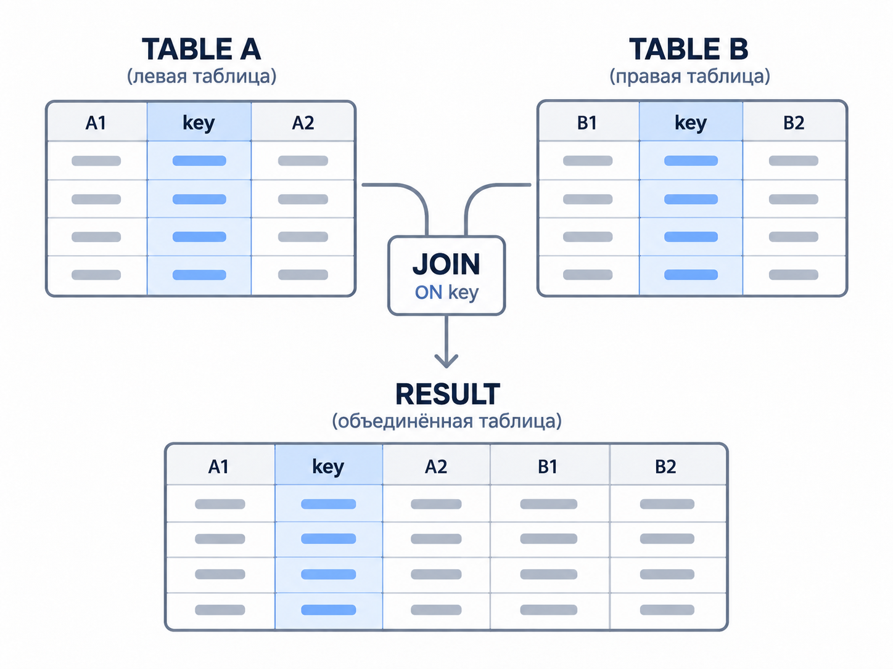
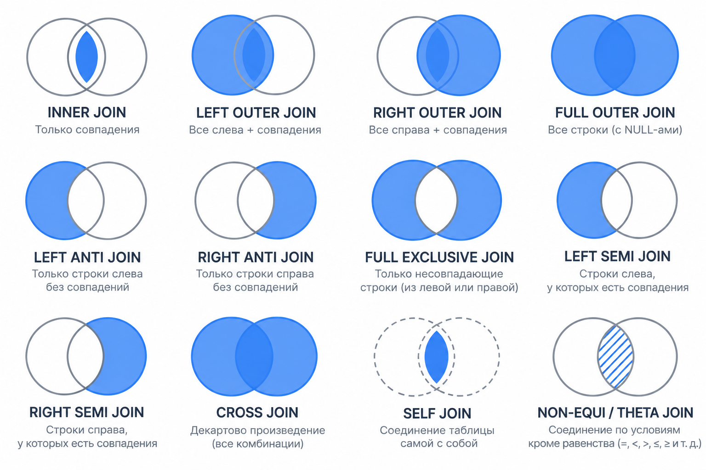

# **Lesson 3. JOIN, CTE и операции над множествами**

На прошлой паре мы считали показатели внутри одной таблицы. Но имя пассажира, цена перелёта и модель самолёта лежат в разных таблицах. Сегодня научимся соединять их.

---

## **Сегодня пройдемся по этому плану:**

1. **Alias таблицы** – короткое имя и запись `alias.column`.
2. **Ключи и условие** `ON`.
3. **Однозначные колонки** – когда имя таблицы можно не писать.
4. `INNER`, `LEFT`, `RIGHT`, `FULL OUTER JOIN`.
5. **Anti join, semi join и full exclusive join**.
6. `CROSS JOIN`.
7. **Self join**.
8. **Non-equi / theta join**.
9. **CTE** – короткое повторение знакомого инструмента.
10. `UNION ALL` – строки друг под другом.

---

## **Часть 0. Для чего вообще нужны разные таблицы?**

Представим покупку авиабилета.

У нас есть пассажир, рейс, аэропорты, самолёт и цена. Можно записать всё в одну огромную таблицу, но тогда огромное количество данных (к примеру, имя аэропорта и модель самолёта) будет повторятся тысячи раз.


Поэтому данные разделены по смыслу:


| Таблица     | Что означает одна строка            |
| ----------- | ----------------------------------- |
| `airplanes` | один тип самолёта                   |
| `airports`  | один аэропорт                       |
| `flights`   | один рейс в конкретную дату         |
| `timetable` | один рейс вместе с данными маршрута |
| `tickets`   | один билет пассажира                |
| `segments`  | один перелёт из билета              |


**Зачем это нужно?** Представим, что модель самолёта записана прямо в каждом рейсе. Исправили название модели – пришлось менять тысячи строк. После нормализации код самолёта остаётся в расписании, а название хранится один раз в `airplanes`.

> **Нормализация** – разделение данных по сущностям, чтобы один факт хранился в одном месте.


Коротко о первых нормальных формах:


| Форма | Простая идея                                | Пример                                                            |
| ----- | ------------------------------------------- | ----------------------------------------------------------------- |
| 1НФ   | в одной ячейке – одно значение, а не список | сегменты билета лежат отдельными строками                         |
| 2НФ   | свойства строки зависят от всего её ключа   | цена в `segments` относится к паре «билет + рейс»                 |
| 3НФ   | описание другой сущности выносим отдельно   | модель самолёта хранится в `airplanes`, а маршрут содержит её код |


Формальные определения строже, но пока нам достаточно главной мысли: **каждый факт кладём туда, где он принадлежит своей сущности**. `JOIN` помогает собрать разделённые факты обратно для ответа.

В демобазе маршрут может изменяться со временем. Таблица `flights` хранит номер маршрута и время рейса, а аэропорты и самолёт относятся к `routes`.

Представление `timetable` уже соединило рейс с нужной версией маршрута. Поэтому из него можно сразу взять:

- `departure_airport`;
- `arrival_airport`;
- `airplane_code`.

---

## **Часть I. Псевдоним таблицы**

Во всех запросах, что мы писали, каждый столбец находится самостоятельно, нам не нужно писать из какой именно таблицы мы делаем запрос, так как именно с одной таблицей мы и имеем дело. Но когда мы начнем взаимодействовать с несколькими таблицами, начнутся проблемы! Поэтому давайте (до того, как мы дойдем до нашего первого `JOIN`) посмотрим как можно задавать полный путь аттрибута (столбца) таблицы!

Так мы выводили все столбцы.

```sql
SELECT *
FROM airplanes;
```

Теперь через алиас (или же псевдоним) назовём гораздо короче – `a`:

```sql
SELECT *
FROM airplanes AS a;
```

Результат тот же.  То есть мы договорились обозначать, что внутри запроса `a` будет обоначать `airplanes`.

> **Псевдоним таблицы (alias)** – короткое имя таблицы внутри одного запроса.

К колонке обращаемся через точку:

```sql
SELECT a.model
FROM airplanes AS a;
```

`a.model` читается как «колонка `model` из таблицы `a`».

### Все колонки одной таблицы

```sql
SELECT a.*
FROM airplanes AS a;
```

`a.*` означает «все колонки таблицы `a`».

Пока таблица одна, результат совпадает с `SELECT *`. После `JOIN` запись пригодится, чтобы взять все колонки только одной стороны.

В домашней работе перечисляем колонки явно, если условие не просит вывести все.

### Alias можно писать без `AS`

Эти запросы равнозначны:

```sql
SELECT a.model
FROM airplanes AS a;
```

```sql
SELECT a.model
FROM airplanes a;
```

Сначала будем писать `AS`: так момент появления нового имени виден лучше.

### Alias таблицы и alias колонки

```sql
SELECT a.model AS airplane_model
FROM airplanes AS a;
```

- `a` – короткое имя таблицы;
- `airplane_model` – имя колонки результата.

Псевдонимы живут только внутри одного запроса. Таблица и колонка в базе не переименовываются.

---


## **Часть II.** `JOIN` ****`JOIN`'ом**, но как объединять то?**

Давайте посмотрим на таблицу `segments`! В ней есть номер билета, но нет имени пассажира:

```sql
SELECT ticket_no,
       flight_id,
       fare_conditions,
       price
FROM segments
ORDER BY ticket_no, flight_id
LIMIT 5;
```


При этом имя пассажира можно найти в таблице `tickets`:

```sql
SELECT ticket_no,
       passenger_name
FROM tickets
ORDER BY ticket_no
LIMIT 5;
```


Видим, что и там, и там есть что-то одинаковое! Это `ticket_no` – обозначает один билет:

```text
segments.ticket_no = tickets.ticket_no
```


И отсюда мы приходим к определениям:

> **Первичный ключ** – колонка или набор колонок, который однозначно определяет строку таблицы.  
> **Внешний ключ** – колонка, которая ссылается на ключ другой таблицы.

`tickets.ticket_no` – первичный ключ, а `segments.ticket_no` ссылается на него.


Посмотрим на общую механику:



`JOIN` находит строки с подходящим ключом и ставит их колонки рядом.

Общая карта видов соединения:



Синим показаны строки, которые попадут в результат.

На схеме смешаны **две группы** подписей:

- `INNER` **/** `LEFT` **/** `RIGHT` **/** `FULL` – ключевые слова SQL в PostgreSQL.
- `SEMI` **/** `ANTI` **/** `EXCLUSIVE` – имена **приёмов**, с которыми мы познакомимся!

  
Все подвиды из второг опункта реализовываются в SQL в качестве дополнительных фильтраций! Часто через оператор `EXISTS` или проверку на `NULL`.

В Spark SQL и Hive встречаются явные `LEFT SEMI JOIN` / `LEFT ANTI JOIN` – **та же идея**, другой синтаксис. На экзамене по нашему курсу достаточно записи для PostgreSQL.

Соберём разделённые факты в один запрос:

```sql
SELECT t.ticket_no,
       t.passenger_name,
       s.flight_id,
       s.price
FROM tickets AS t
JOIN segments AS s
  ON s.ticket_no = t.ticket_no
WHERE t.book_ref = '0000EG'
ORDER BY t.ticket_no, s.flight_id;
```

Слева – билеты одного небольшого бронирования. Справа – сегменты с тем же `ticket_no`. Колонки двух таблиц стоят в одной строке результата.

---


## **Часть III. Перед вступлением – немного о синтаксисе.**  
**Можно ли не писать имя таблицы?**

После `JOIN` имя колонки нужно указывать аккуратнее.

Да, если PostgreSQL понимает источник однозначно:

```sql
SELECT model
FROM airplanes AS a;
```

Колонка `model` есть только в `airplanes`, поэтому запрос выполнится.

В `segments` и `tickets` есть общий `ticket_no`. Такая запись неоднозначна:

```text
SELECT ticket_no
FROM segments AS s
JOIN tickets AS t
  ON t.ticket_no = s.ticket_no;
```

PostgreSQL не выбирает таблицу по смыслу. Он вернёт ошибку:

```text
column reference "ticket_no" is ambiguous
```

Нужно указать источник:

```sql
SELECT s.ticket_no,
       t.passenger_name
FROM segments AS s
JOIN tickets AS t
  ON t.ticket_no = s.ticket_no
WHERE t.book_ref = '0000EG';
```

Короткое правило:

- колонка встречается только в одном источнике – имя таблицы можно не писать;
- колонка есть в нескольких источниках – нужен `alias.column`;
- в учебных `JOIN` лучше указывать alias у всех колонок: запрос легче читать.

---


## **Часть IV.** `INNER JOIN`

> `INNER JOIN` – оставляет только строки, для которых нашлась пара.

Запрос из части II — как раз inner join. Повторим его явно:

```sql
SELECT t.ticket_no,
       t.passenger_name,
       s.flight_id,
       s.price
FROM tickets AS t
INNER JOIN segments AS s
  ON s.ticket_no = t.ticket_no
WHERE t.book_ref = '0000EG'
ORDER BY t.ticket_no, s.flight_id;
```

Слева берём билеты одного небольшого бронирования. Справа ищем сегменты каждого билета.

Если для билета нашлось несколько сегментов, пассажир появится в нескольких строках – по одной на каждый перелёт.

Если пары нет, билет в результат не попадёт.

Слово `INNER` можно опустить:

```sql
SELECT t.ticket_no,
       t.passenger_name,
       s.flight_id
FROM tickets AS t
JOIN segments AS s
  ON s.ticket_no = t.ticket_no
WHERE t.book_ref = '0000EG'
ORDER BY t.ticket_no, s.flight_id;
```

Обычный `JOIN` означает `INNER JOIN`.

### Все колонки одной стороны

```sql
SELECT s.*,
       t.passenger_name
FROM segments AS s
JOIN tickets AS t
  ON t.ticket_no = s.ticket_no
WHERE t.book_ref = '0000EG'
ORDER BY s.flight_id;
```

`s.*` выводит все колонки `segments`. Из `tickets` добавлена только одна колонка.

Если написать просто `SELECT *`, PostgreSQL вернёт все колонки обеих таблиц.

---


## **Часть V.** `LEFT OUTER JOIN`

> `LEFT OUTER JOIN` – сохраняет все строки слева и добавляет найденные строки справа.

В `INNER JOIN` билет без сегмента в результат не попадал. Поменяем только тип соединения — таблицы и ключ те же:

```sql
SELECT t.ticket_no,
       t.passenger_name,
       s.flight_id,
       s.price
FROM tickets AS t
LEFT JOIN segments AS s
  ON s.ticket_no = t.ticket_no
WHERE t.book_ref = '0000EG'
ORDER BY t.ticket_no, s.flight_id;
```

Слева `tickets`, поэтому **каждый** билет бронирования остаётся. Справа подставляется сегмент, если он есть.

Если пары нет, колонки из `segments` (`flight_id`, `price`, …) будут `NULL`. Дополнительных условий в `ON` пока не добавляем — только равенство ключей, как в inner join.

### Несколько `LEFT JOIN` подряд

К тем же билетам по очереди подтягиваем сегмент и рейс:

```sql
SELECT t.ticket_no,
       t.passenger_name,
       s.flight_id,
       f.status AS flight_status
FROM tickets AS t
LEFT JOIN segments AS s
  ON s.ticket_no = t.ticket_no
LEFT JOIN flights AS f
  ON f.flight_id = s.flight_id
WHERE t.book_ref = '0000EG'
ORDER BY t.ticket_no, s.flight_id
LIMIT 10;
```

Нет сегмента — колонки `s` будут `NULL`. Нет рейса — `NULL` в `f`. Билет слева всё равно останется.

Слово `OUTER` обычно опускают:

```text
LEFT JOIN = LEFT OUTER JOIN
```

---


## **Часть VI.** `RIGHT OUTER JOIN`

> `RIGHT OUTER JOIN` – сохраняет все строки справа и добавляет найденные строки слева.

Три московских аэропорта — справа. Слева — рейсы с совпавшим кодом отправления. В `ON` только равенство:

```sql
SELECT a.airport_code,
       a.airport_name,
       t.route_no
FROM timetable AS t
RIGHT JOIN airports AS a
  ON t.departure_airport = a.airport_code
WHERE a.airport_code IN ('SVO', 'VKO', 'ZIA')
ORDER BY a.airport_code, t.route_no
LIMIT 15;
```

Все три аэропорта остаются. Если подходящего рейса нет, `t.route_no` будет `NULL`.

Тот же вопрос можно записать через `LEFT JOIN`, если поменять таблицы местами. `RIGHT JOIN` здесь — чтобы явно увидеть «главную» правую сторону.

```text
RIGHT JOIN = RIGHT OUTER JOIN
```

На практике `RIGHT JOIN` встречается реже. Обычно таблицы меняют местами и пишут цепочку через `LEFT JOIN`: так запрос читается слева направо.

---


## **Часть VII.** `FULL OUTER JOIN`

> `FULL OUTER JOIN` – сохраняет все строки обеих сторон.

Как `LEFT` и `RIGHT`, но **ни одну** сторону не выбрасываем: совпадения, «висячие» слева и «висячие» справа.

### Две таблицы, простой `ON`

```sql
SELECT a.airport_code,
       a.airport_name,
       t.flight_id
FROM airports AS a
FULL JOIN timetable AS t
  ON t.departure_airport = a.airport_code
 AND t.flight_id <= 20
WHERE a.airport_code IN ('SVO', 'VKO', 'BKA', 'DME')
ORDER BY a.airport_code, t.flight_id
LIMIT 20;
```

Срез `flight_id <= 20` стоит в `ON`. Аэропорт без рейса в этом срезе остаётся с `NULL` в колонках `timetable`.

### Два среза одной таблицы

Иногда слева и справа — **разные смыслы** из одного источника. Сравним коды **отправления** и **прибытия** у первых двадцати рейсов. Здесь без подзапроса или CTE не обойтись — ниже один запрос со скобками; те же списки можно назвать через `WITH` (как на прошлой паре).

```sql
SELECT dep.airport_code AS departure_airport,
       arr.airport_code AS arrival_airport
FROM (
    SELECT DISTINCT departure_airport AS airport_code
    FROM timetable
    WHERE flight_id <= 20
) AS dep
FULL JOIN (
    SELECT DISTINCT arrival_airport AS airport_code
    FROM timetable
    WHERE flight_id <= 20
) AS arr
  ON arr.airport_code = dep.airport_code
ORDER BY dep.airport_code NULLS LAST,
         arr.airport_code NULLS LAST;
```

Код есть с обеих сторон — заполнены обе колонки. Только отправление — `NULL` справа. Только прибытие — `NULL` слева.

> `FULL JOIN` **≠** `UNION ALL`**.** Join ставит колонки **рядом** и ищет **пары** по `ON`. `UNION ALL` складывает строки **друг под другом** без сопоставления. **Full exclusive** (часть IX) ближе к «симметрической разности» двух списков, а не к `UNION`.

```text
FULL JOIN = FULL OUTER JOIN
```

---


## **Часть VIII. Anti join**

Anti join отвечает на вопрос: «Каким строкам **не** нашлась пара?»

Задача с занятия: **аэропорты, из которых ни разу не было вылета** в расписании. Справа — не весь `timetable` (на student-хосте join «аэропорт × все рейсы» может идти **очень долго**), а короткий список кодов отправления:

### Left anti join

```sql
SELECT a.airport_code,
       a.airport_name,
       a.city
FROM airports AS a
LEFT JOIN (
    SELECT DISTINCT departure_airport AS airport_code
    FROM timetable
) AS used
  ON used.airport_code = a.airport_code
WHERE used.airport_code IS NULL
ORDER BY a.airport_code
LIMIT 15;
```

`LEFT JOIN` сохраняет аэропорты. `used.airport_code IS NULL` — коду **не нашлось** места среди отправлений.

> На demo у билетов почти всегда есть сегменты — anti на `tickets` + `segments` в `psql` часто **пустой**. Для проверки anti удобнее аэропорты.

Тот же смысл без join — `WHERE NOT EXISTS (SELECT 1 FROM timetable AS t WHERE t.departure_airport = a.airport_code)`.

### Right anti join

«Главная» таблица справа:

```sql
SELECT a.airport_code,
       a.airport_name
FROM (
    SELECT DISTINCT departure_airport AS airport_code
    FROM timetable
) AS used
RIGHT JOIN airports AS a
  ON used.airport_code = a.airport_code
WHERE used.airport_code IS NULL
ORDER BY a.airport_code
LIMIT 15;
```

`LEFT ANTI JOIN` и `RIGHT ANTI JOIN` – названия способов рассуждать. Отдельных операторов с такими именами в PostgreSQL нет.

---


## **Часть IX. Full exclusive join**

`FULL JOIN` из части VII показал и совпадения, и `NULL` с одной стороны. **Full exclusive** — только строки **без пары**: код был либо только отправлением, либо только прибытием.

К запросу из части VII добавляем один фильтр:

```text
WHERE dep.airport_code IS NULL
   OR arr.airport_code IS NULL
```

```sql
SELECT dep.airport_code AS departure_airport,
       arr.airport_code AS arrival_airport
FROM (
    SELECT DISTINCT departure_airport AS airport_code
    FROM timetable
    WHERE flight_id <= 20
) AS dep
FULL JOIN (
    SELECT DISTINCT arrival_airport AS airport_code
    FROM timetable
    WHERE flight_id <= 20
) AS arr
  ON arr.airport_code = dep.airport_code
WHERE dep.airport_code IS NULL
   OR arr.airport_code IS NULL
ORDER BY dep.airport_code NULLS LAST,
         arr.airport_code NULLS LAST;
```

`FULL EXCLUSIVE JOIN` – название приёма, а не отдельная команда PostgreSQL. Это не `UNION ALL`: мы по-прежнему в двух колонках видим, **с какой стороны** «лишний» код.

---


## **Часть X. Semi join**

Semi join отвечает на вопрос: «У каких строк **есть** хотя бы одна пара?»

В результат попадают **только колонки одной** таблицы — без дублирования, как при `INNER JOIN`, если справа несколько сегментов на один билет.

### Left semi join

Билеты бронирования `0000EG`, для которых **есть** хотя бы один сегмент:

```sql
SELECT t.ticket_no,
       t.passenger_name
FROM tickets AS t
WHERE t.book_ref = '0000EG'
  AND EXISTS (
      SELECT 1
      FROM segments AS s
      WHERE s.ticket_no = t.ticket_no
  )
ORDER BY t.ticket_no;
```

> `EXISTS` — для **каждой** строки `tickets` PostgreSQL спрашивает: «подзапрос вернул хотя бы одну строку?»

- `SELECT 1` внутри — заглушка; наружу единица не выходит.
- `WHERE s.ticket_no = t.ticket_no` — **корреляция**: `t.ticket_no` снаружи подставляется в условие для **текущего** билета (в запросе выше оба `ticket_no` с префиксом `s.` и `t.`).

Тот же semi можно записать без `EXISTS`: `JOIN segments` + `SELECT DISTINCT` по билету — когда так читается легче.

> **Anti** — зеркальный вопрос: **ноль** пар. Запись: `NOT EXISTS (...)` с тем же условием внутри или `LEFT JOIN` + `IS NULL` (часть VIII).


### Right semi join

Сегменты, для которых **есть** билет этого же бронирования:

```sql
SELECT s.ticket_no,
       s.flight_id,
       s.price
FROM segments AS s
WHERE EXISTS (
    SELECT 1
    FROM tickets AS t
    WHERE t.ticket_no = s.ticket_no
      AND t.book_ref = '0000EG'
)
ORDER BY s.ticket_no, s.flight_id;
```

Отдельных ключевых слов `LEFT SEMI JOIN` и `RIGHT SEMI JOIN` в PostgreSQL нет. Удобный способ записи — `EXISTS`.

### Semi и anti — один мост, два вопроса

Одна связь (например аэропорт ↔ вылеты, билет ↔ сегмент):


|                 | **Semi**          | **Anti**                                       |
| --------------- | ----------------- | ---------------------------------------------- |
| Вопрос          | есть **≥1** пара? | **нет** ни одной пары?                         |
| Типичная запись | `EXISTS (...)`    | `NOT EXISTS (...)` или `LEFT JOIN` + `IS NULL` |


---


## **Часть XI.** `CROSS JOIN`

> `CROSS JOIN` – соединение каждой строки слева с каждой строкой справа.

Возьмём из реальных таблиц две модели самолётов и два класса обслуживания:

```sql
SELECT a.airplane_code,
       f.fare_conditions
FROM airplanes AS a
CROSS JOIN (
    SELECT DISTINCT fare_conditions
    FROM seats
    WHERE fare_conditions IN ('Economy', 'Business')
) AS f
WHERE a.airplane_code IN ('32N', 'CR7')
ORDER BY a.airplane_code, f.fare_conditions;
```

Две модели умножились на два класса:

```text
2 × 2 = 4 строки
```

У `CROSS JOIN` нет условия `ON`: нужны все комбинации.

Если слева 1000 строк и справа 1000 строк, получится миллион. Поэтому используем его только тогда, когда все комбинации действительно нужны.

---


## **Часть XII. Self join**

Иногда нужно сравнить строки одной таблицы между собой.

Вопрос: «Какие разные аэропорты находятся в одном городе?»

```sql
SELECT a1.city,
       a1.airport_code AS first_airport,
       a2.airport_code AS second_airport
FROM airports AS a1
JOIN airports AS a2
  ON a1.city = a2.city
 AND a1.country = a2.country
 AND a1.airport_code < a2.airport_code
WHERE a1.country = 'Russia'
ORDER BY a1.city, first_airport, second_airport;
```

> **Self join** – соединение таблицы с самой собой. Два alias позволяют обратиться к двум разным строкам одной таблицы.

- `a1.city = a2.city` – город совпадает;
- `a1.country = a2.country` – города разных стран не смешиваются;
- `a1.airport_code < a2.airport_code` – каждая **неупорядоченная** пара аэропортов один раз: нет `(SVO, SVO)` и нет пары `(SVO, DME)` вместе с `(DME, SVO)`.

Self join не является отдельным ключевым словом. Это обычный `JOIN`, где слева и справа одна таблица под разными именами.

---


## **Часть XIII. Non-equi / theta join**

До сих пор строки соединялись по равенству:

```text
left.key = right.key
```

Но условие `ON` может содержать другое сравнение.

Вопрос: «Какие модели летают дальше, чем Bombardier CRJ700?»

```sql
SELECT shorter.model AS base_model,
       shorter.range AS base_range,
       longer.model AS longer_model,
       longer.range AS longer_range
FROM airplanes AS shorter
JOIN airplanes AS longer
  ON longer.range > shorter.range
WHERE shorter.airplane_code = 'CR7'
ORDER BY longer.range, longer.airplane_code;
```

> **Equi join** — соединение по `=` (ключи). Это самый частый случай.

> **Non-equi join** – в `ON` главное условие не равенство, а `<`, `>`, `<=`, `>=` или другой предикат.

> **Theta join** – общее имя: **любое** условие в `ON`; equi join — его частный случай.

Здесь одновременно используются self join и условие `>`.

---


## **Часть XIV.** `ON` **и** `WHERE`

В части V в `ON` было одно равенство ключей. На практике справа часто нужна не «любая пара», а строка с дополнительными условиями — их обычно добавляют в `ON`, а не в `WHERE`.

Пример: все московские аэропорты и только **будущие** рейсы со статусом `Scheduled`:

```sql
SELECT a.airport_code,
       a.airport_name,
       t.flight_id
FROM airports AS a
LEFT JOIN timetable AS t
  ON t.departure_airport = a.airport_code
 AND t.status = 'Scheduled'
 AND t.scheduled_departure >= bookings.now()
WHERE a.city = 'Moscow'
  AND a.country = 'Russia'
ORDER BY a.airport_code, t.flight_id
LIMIT 15;
```

Условия разделены по смыслу:


| Место   | Что делает                         |
| ------- | ---------------------------------- |
| `ON`    | определяет подходящий будущий рейс |
| `WHERE` | оставляет московские аэропорты     |


Если перенести `t.status = 'Scheduled'` в `WHERE`, строка без рейса получит `t.status = NULL`.

```text
NULL = 'Scheduled'
```

Результат – `UNKNOWN`, и строка исчезнет. `LEFT JOIN` потеряет смысл.

---


## **Часть XV. CTE – короткое повторение**

CTE уже появился на второй паре. Это не вид `JOIN`, поэтому отдельно заново его не изучаем.

Используем CTE, чтобы разделить два действия:

1. посчитать выручку каждого рейса;
2. добавить статус рейса.

Сначала первый шаг:

```sql
SELECT flight_id,
       sum(price) AS revenue
FROM segments
WHERE flight_id <= 20
GROUP BY flight_id
ORDER BY flight_id;
```

Теперь дадим результату имя:

```sql
WITH sales_by_flight AS (
    SELECT flight_id,
           sum(price) AS revenue
    FROM segments
    WHERE flight_id <= 20
    GROUP BY flight_id
)
SELECT s.flight_id,
       f.status,
       s.revenue
FROM sales_by_flight AS s
JOIN flights AS f
  ON f.flight_id = s.flight_id
ORDER BY s.flight_id;
```

> **CTE** – именованный результат подзапроса после `WITH`, доступный внутри одного statement.

Короткий запрос не нужно оборачивать в `WITH` без причины. Сначала проверяем простые части, затем соединяем их.

---


## **Часть XVI.** `UNION ALL`

`JOIN` ставит колонки рядом. `UNION ALL` ставит строки друг под другом.

```sql
SELECT 'departure' AS event_type

UNION ALL

SELECT 'arrival' AS event_type;
```

Получили две строки.

> `UNION ALL` – операция, которая ставит результаты нескольких `SELECT` друг под другом и сохраняет повторы.

Реальный пример – поток плановых и фактических вылетов:

```sql
SELECT flight_id,
       scheduled_departure AS event_time,
       'scheduled_departure' AS event_type
FROM flights
WHERE status = 'Arrived'
  AND flight_id <= 10

UNION ALL

SELECT flight_id,
       actual_departure AS event_time,
       'actual_departure' AS event_type
FROM flights
WHERE status = 'Arrived'
  AND actual_departure IS NOT NULL
  AND flight_id <= 10

ORDER BY flight_id, event_type;
```

У частей должны совпадать число, порядок и совместимые типы колонок.

Имена результата берутся из первого `SELECT`. Общий `ORDER BY` ставится после последней части.

### `UNION ALL` и `UNION`

**Дубликат** — две строки **полностью одинаковые** во всех колонках.

`UNION ALL` **не убирает** повторы — все строки обеих частей попадают в результат. `UNION` после склейки **схлопывает** полные дубликаты (как `DISTINCT` на всём наборе). На больших данных `UNION` обычно **медленнее**: нужна проверка уникальности.

Микро-пример:

```sql
SELECT 'departure' AS event_type
UNION ALL
SELECT 'departure' AS event_type;
```

→ **2 строки**. С `UNION` вместо `UNION ALL` → **1 строка**.

Когда нужен **полный поток** (план + факт, два источника событий) — `UNION ALL`. Когда нужен **набор уникальных** кодов — `UNION`.

```sql
SELECT airport_code
FROM airports
WHERE city = 'Moscow'

UNION

SELECT airport_code
FROM airports
WHERE country = 'Russia'
ORDER BY airport_code;
```

Московский аэропорт подходит обеим частям, но в результате `UNION` останется один раз.

---


## **Шпаргалка по видам соединений**


| Название              | Запись в PostgreSQL                       | Что остаётся                            |
| --------------------- | ----------------------------------------- | --------------------------------------- |
| inner join            | `INNER JOIN` или `JOIN`                   | только найденные пары                   |
| left outer join       | `LEFT JOIN`                               | все слева и совпадения справа           |
| right outer join      | `RIGHT JOIN`                              | все справа и совпадения слева           |
| full outer join       | `FULL JOIN`                               | все строки обеих сторон                 |
| left anti join        | `LEFT JOIN` + `WHERE right.key IS NULL`   | строки слева без пары                   |
| right anti join       | `RIGHT JOIN` + `WHERE left.key IS NULL`   | строки справа без пары                  |
| full exclusive join   | `FULL JOIN` + проверка `NULL`             | все несовпавшие строки                  |
| left semi join        | `WHERE EXISTS (...)`                      | строки слева, у которых есть пара       |
| right semi join       | `WHERE EXISTS (...)` с обратной стороны   | строки справа, у которых есть пара      |
| cross join            | `CROSS JOIN`                              | все комбинации                          |
| self join             | одна таблица с двумя alias                | строки таблицы сравниваются между собой |
| non-equi / theta join | `JOIN ... ON` с `<`, `>`, другим условием | пары по произвольному условию           |


Главные вопросы:

```text
Какие строки образуют пару?
Какую сторону нужно сохранить?
Сколько строк справа может найти одна строка слева?
Что означает одна строка после соединения?
```

---


## **Итог**

Сегодня мы:

- дали таблице короткое имя;
- выяснили, когда колонку можно писать без alias;
- вывели все колонки одной стороны через `alias.*`;
- связали первичный и внешний ключ через `ON`;
- разобрали `INNER`, `LEFT`, `RIGHT` и `FULL OUTER JOIN`;
- получили строки без пары через anti join;
- получили строки с парой через semi join;
- оставили все несовпадения через full exclusive join;
- построили все комбинации через `CROSS JOIN`;
- сравнили строки одной таблицы через self join;
- соединили строки по неравенству через non-equi join;
- коротко повторили CTE;
- поставили строки друг под другом через `UNION ALL`.

На следующей паре будем сравнивать строку с соседними строками внутри группы – появятся оконные функции.

До встречи на следующей страничке!

## **Полезное**

- [Соединения таблиц](https://postgrespro.ru/docs/postgresql/current/queries-table-expressions#QUERIES-JOIN)
- [Псевдонимы таблиц и колонок](https://postgrespro.ru/docs/postgresql/current/queries-table-expressions#QUERIES-TABLE-ALIASES)
- [Подзапросы и EXISTS](https://postgrespro.ru/docs/postgresql/current/functions-subquery)
- [WITH и CTE](https://postgrespro.ru/docs/postgresql/current/queries-with)
- [UNION, INTERSECT и EXCEPT](https://postgrespro.ru/docs/postgresql/current/queries-union)
- [Демобаза «Авиаперевозки»](https://postgrespro.ru/docs/postgrespro/current/demodb-bookings)

